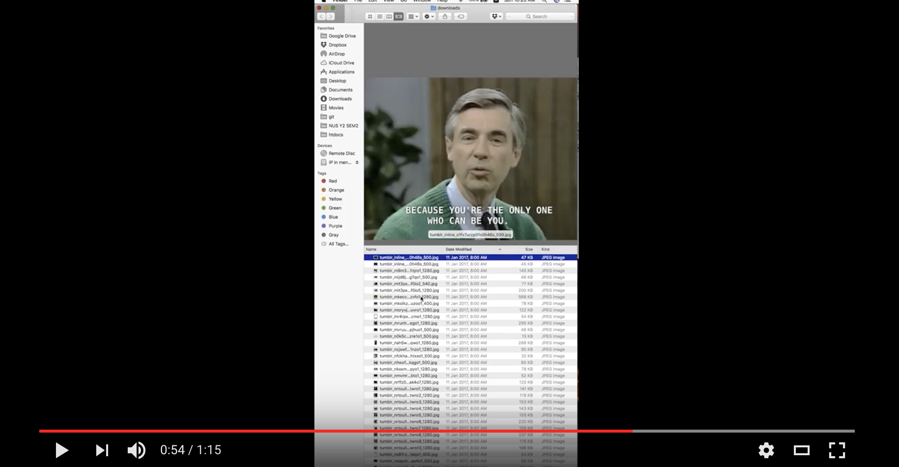

# scraper-tumblr-node

download all pictures from tumblr

## demo
[](https://www.youtube.com/watch?v=IXfHHgW3HAw)

## to use

Unfortunately no cli, fork and pull if you have time.

1. Clone this repo
2. Edit tumblr.js
```
tumblrs = [
    '50thousand',
    'xx6emo6girl6xx'
    // insert more here
]

startPage = 3
endPage = 4
```
3. run `npm install && node tumblr.js` in terminal
4. Stuff all downloaded in [downloads](/downloads) folder